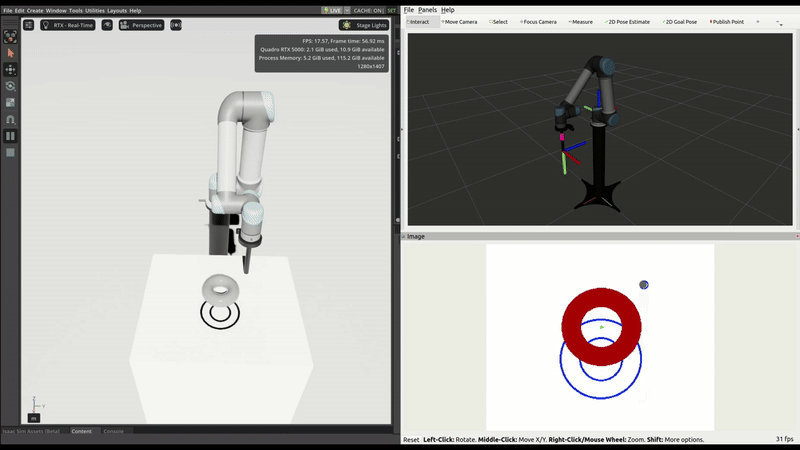

# UR5-BarAlign-RL-Isaac-sim ..


## Prerequisites

- [Isaac Sim](https://developer.nvidia.com/isaac-sim)
- [lerobot](https://github.com/lerobot)

## Index

1. [Data Collection for Training](#1-data-collection-for-training)  
2. [Organize Collected Data for LeRobot](#2-organize-collected-data-for-lerobot)  
3. [Training the Robot](#3-training-the-robot)  
4. [Policy Evaluation](#4-policy-evaluation)  

## 1. Data Collection for Training

### Step 1: Open Simulation in Isaac Sim

- Launch the `pushT.usd` scene file inside **Isaac Sim**.

### Step 2: Build the Workspace

```bash
cd ur5_simulation
colcon build
source install/setup.bash
```

### Step 3: Launch Robot Control

```bash
ros2 launch ur5_moveit_config arm_joy_control.launch.py
```

### Step 4: Run the Data Collection Script

```bash
cd ur5_simulations/src/data_collection/scripts
python3 data_collection.py
```

### Step 5: Play the Simulation and Collect Data

1. **Press Play** in **Isaac Sim**.
2. Use any **USB controller** to manually move the **UR5 robot**.
3. Press the **X button** to start recording:
   - You will see the **number of episodes** and **correction percentage**.
   - As the object aligns with the target marking, the **correction percentage increases**.
   - Recording will **automatically stop** once the correction percentage **exceeds 90%**.

### Step 6: Update Final Index in Script

Once the recording stops, **note the last index number** shown in the terminal.

Then, open the `data_collection.py` file and update the following lines (around line 184):

```python
self.index = <last_index_number>
self.episode_index = 1
```
Replace `<last_index_number>` with the value noted after the recording ends

## 2. Organize Collected Data for LeRobot

### Step 1: Create Required Directory Structure

You need to organize the collected data according to the folder structure expected by **LeRobot**.

Move the collected files as follows:

#### Move Collected Episodes (.parquet files)

From:  
`ur5_simulation/src/data_collection/scripts/my_pusht/data/chunk_000`

To:  
`training_data/lerobot/my_pusht/data/chunk-000`

#### Move Collected Recordings (.mp4 files)

From:  
`ur5_simulation/src/data_collection/scripts/my_pusht/videos/chunk_000/observation.images.state`

To:  
`training_data/lerobot/my_pusht/videos/chunk-000/observation.image`

### Step 2: Generate Episode Metadata

Run the following commands to generate metadata required by LeRobot:

```bash
cd ur5_simulation/lerobot_related
python3 create_episodes_jsonl.py
python3 create_episodes_stats_jsonl.py
```

### Step 3: Move Generated Metadata Files

#### Move the generated metadata files to the `meta` directory:

From:  
`ur5_simulation/lerobot_related/episodes.jsonl`
`ur5_simulation/lerobot_related/episodes_stats.jsonl`

To:  
`training_data/lerobot/my_pusht/meta/`

#### Ensure that the final directory structure looks like this:

```
training_data/
└── lerobot/
    └── my_pusht/
        ├── data/
        │   └── chunk-000/
        ├── videos/
        │   └── chunk-000/
        │       └── observation.image/
        └── meta/
            ├── episodes.jsonl
            └── episodes_stats.jsonl
```

## 3. Training the Robot

### Step 1: Move Training Scripts

Move the following scripts from `ur5_simulation/lerobot_related` to `lerobot/examples`:

- `2_evalute_pretrained_policy_ROS.py`
- `3_train_policy_mod.py`

### Step 2: Run Training Script

Execute the training by running:

```bash
cd lerobot/examples
python3 3_train_policy_mod.py
```

The trained model will be saved under: `lerobot/examples/outputs/train/my_pusht_diffusion/<date_time>`

## 4. Policy Evaluation

### Step 1: Update Model Path

Before running the evaluation script, update the path to the trained model in `2_evalute_pretrained_policy_ROS.py` (around line 40):

```python
pretrained_policy_path = Path("outputs/train/my_pusht_diffusion/20250329093535")
```
Replace the path with the directory of your trained model.

### Step 2: Open Simulation in Isaac Sim

- Launch the `pushT.usd` scene file in **Isaac Sim**.
- Press **Play**.

### Step 3: Launch ROS2 and Run Evaluation Script

```bash
cd ur5_simulation
source install/setup.bash
ros2 launch ur5_moveit_config arm_diffusion_control.launch.py

cd lerobot/examples/
python3 2_evalute_pretrained_policy_ROS.py
```
